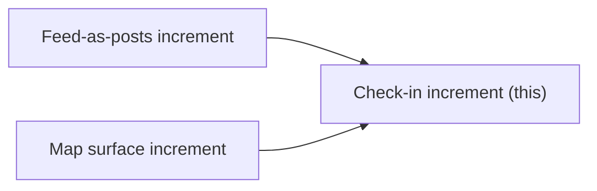

# Increment: Check-in and save (client-only delight layer)

> Status note: this spec documents the v1 client-only check-in and save layer, most of which is
> now built. The v2 redesign supersedes its scope where they overlap. In v2, check-in gains
> server-side verification and awards points to a wallet, behind an account. See
> [Redesign](redesign.md), [Wallet and presence](wallet-and-presence.md), and
> [Interactions](interactions.md). Read this file as the history of the client-only layer, not
> as the current plan for check-in.

**Sequencing:** Last increment. Ships only after the **map surface** and **feed-as-posts** increments land. Does not block them. First cut if the week runs short.

**Path note:** No prior increment spec files exist in [`docs/`](docs/). This plan follows the shape requested in the brief. All file paths below were opened and confirmed in the `grounded-art` repo unless marked *planned (new)*.

---

## What ships

A thin, optional layer on top of the existing directory:

1. **Post detail route** at `/feed/[slug]` (user-confirmed), server-fetched via existing [`getFeedItem(slug)`](apps/web/src/lib/api.ts), with optional gallery resolution via [`getGallery(slug)`](apps/web/src/lib/api.ts) when `gallery_id` is set.
2. **One shared detail card** with **one action row**, reused on post detail and the map gallery side panel. No parallel card implementations.
3. **Conditional actions** resolved from data (see below).
4. **Check-in flow:** browser geolocation, haversine distance to gallery coordinates, success celebration if within radius. No backend, accounts, tokens, points, leaderboard, or content gating.
5. **Saved and checked-in state** persisted on-device via **first-party cookies** (user-confirmed). Survives return visits. No `localStorage` (theme's `ga-theme` in [`theme-toggle.tsx`](apps/web/src/components/theme-toggle.tsx) remains the only localStorage use).
6. **View on map** deep link from post detail to `/map?gallery={slug}`, focusing/selecting that gallery (contract with map increment).
7. **Graceful check-in states** with warm copy: permission denied, unavailable, out-of-range ("not there yet"), and success. No error walls.
8. **Celebration moment** on valid check-in, motion gated behind `prefers-reduced-motion` via `motion/react` and `useReducedMotion()` (added to `apps/web`).
9. **Saved filter pill** on the feed: a "Saved" option in [`feed-filters.tsx`](apps/web/src/components/feed-filters.tsx) that client-side filters the feed list against keys in the `ga-saved` cookie via `UserActionsProvider`.

The directory works fully without any of this. Nothing is locked behind check-in.

---

## Dependencies (must land first)

### Feed-as-posts increment (prerequisite)

| Prerequisite | Why |
|---|---|
| Feed cards link to `/feed/[slug]` | Detail route is useless without entry points from [`feed-card.tsx`](apps/web/src/components/feed-card.tsx) |
| Post-led image layout (optional but expected) | [`feature-list.md`](docs/feature-list.md) lists image layout as part of feed work; detail page should render `image_url` when present |
| Feed list still resolves `gallery_id` to gallery name/slug | Same pattern as [`feed/page.tsx`](apps/web/src/feed/page.tsx) today |

**Contract this increment expects from feed:** tapping a feed item navigates to `/feed/{slug}`. The existing "More" external link on locationless items ([`sample-emerging-artist-spotlight`](apps/api/seed/feed_items.json)) can remain; the card body becomes tappable or gains a "View post" link per design.

### Map surface increment (prerequisite)

| Prerequisite | Why |
|---|---|
| Google Maps base layer via [`maps.ts`](apps/web/src/lib/maps.ts) provider boundary | Check-in needs real gallery `latitude` / `longitude` from [`types.ts`](apps/web/src/lib/types.ts) |
| Gallery markers and side panel | [`maps.md`](docs/pages/maps.md) spec; today [`map/page.tsx`](apps/web/src/map/page.tsx) is a stub |
| `?gallery={slug}` query param handling | Map pans/zooms and opens side panel for that gallery when arriving from "View on map" |

**Map deep link contract (confirmed):** `?gallery={slug}` on `/map`. Checked against the repo today: [`map/page.tsx`](apps/web/src/map/page.tsx) is still a stub with no `searchParams` handling and no alternate param name in use. The map increment should implement `gallery` as the query key. If the map increment lands first with a different param, one increment must change before merge to avoid a broken "View on map" link.

**Contract this increment provides to map:** a shared card component the map side panel imports instead of building its own card + action row.

---

## Action row: conditional visibility

Resolve from a small pure helper (e.g. `resolveActionRowContext` in a new lib module). Inputs: optional `FeedItem`, optional resolved `Gallery`.

| Action | Shown when | Behaviour |
|---|---|---|
| **Save** | Always | Toggle saved state. On post detail: always `feed:{slug}`; when the item resolves to a gallery, also `gallery:{slug}` (both keys). On map card: `gallery:{slug}` only. Either key marks the item or gallery as saved. |
| **Go to artist** | `external_url` is non-null on feed item | Links to `external_url` (new tab). `creative_name` alone is display-only in the content area, not an action. A button with no destination is a trap; never show Go to artist without `external_url`. Icon: person when `creative_name` is set, external-link when locationless per design. Hidden on gallery-only map card. |
| **View on map** | Resolved gallery has non-null `latitude` and `longitude` | Links to `/map?gallery={gallery.slug}` |
| **Check in** | Same as View on map | Runs geolocation check against gallery coordinates |

**Locationless example:** seed item `sample-emerging-artist-spotlight` ([`feed_items.json`](apps/api/seed/feed_items.json)) has `gallery_slug: null`, `creative_name`, `external_url`. Shows Save + Go to artist only. `creative_name` appears in attribution; Go to artist appears because `external_url` is set. Matches [`posts.md`](docs/pages/posts.md).

**Gallery-linked example:** any feed item with `gallery_id` pointing to a seeded gallery (all 14 have coordinates). Shows all four actions when applicable.

---

## Check-in module

**New file (planned):** `apps/web/src/lib/check-in.ts`

| Export | Purpose |
|---|---|
| `CHECK_IN_RADIUS_METRES` | Single tunable constant, default **100** |
| `getUserPosition()` | Wraps `navigator.geolocation.getCurrentPosition` with typed errors |
| `distanceMetres(a, b)` | Haversine between user and gallery lat/lng |
| `evaluateCheckIn(user, gallery)` | Returns `success` / `out_of_range` / `permission_denied` / `unavailable` |

### Radius constant and rationale

- **Default:** `CHECK_IN_RADIUS_METRES = 100` in one place (`check-in.ts`).
- **Basis:** The older MVP in the sibling `groundedart` repo used **per-node** radii (seed data mostly 70 m, some up to 120 m; DB enforced minimum 25 m). Browser GPS in dense city centres is routinely off by 50 m or more. A tight per-venue radius would fail honest check-ins at the door. A single global 100 m default is friendlier for v1 client-only trust-on-device check-in. Per-gallery radii are explicitly out of scope.

No porting from MVP proof-of-presence: no challenge tokens, server verification, rank, notifications, or Solana.

---

## Client store (saved + checked-in)

**Confirmed today:** The web app has no app-state persistence layer. Feed filters use URL search params ([`feed-filters.tsx`](apps/web/src/components/feed-filters.tsx)). Data fetching is server-side via [`api.ts`](apps/web/src/lib/api.ts). Only theme persists, and only via `localStorage`.

**v1 approach (user-confirmed):** first-party cookies.

**New files (planned):**

- `apps/web/src/lib/user-actions.ts`: read/write cookie helpers, slug set types
- `apps/web/src/components/user-actions-provider.tsx`: `"use client"` React context at root layout, hydrates from cookies on mount, exposes `isSaved(key)`, `toggleSave(key)`, `isCheckedIn(gallerySlug)`, `markCheckedIn(gallerySlug)`
- Cookie names (suggestion): `ga-saved`, `ga-checkins`: compact JSON arrays, `SameSite=Lax`, `Path=/`, long `Max-Age`, no `HttpOnly` (client-only writes)

**Checked-in key:** gallery slug only (check-in is always at a physical gallery).

**Saved keys:** prefixed `feed:{slug}` and/or `gallery:{slug}`. Gallery-linked feed items write both on save. The Saved filter pill matches any feed item whose `feed:{slug}` **or** resolved `gallery:{slug}` is in `ga-saved`.

Wire provider in [`layout.tsx`](apps/web/src/app/layout.tsx) wrapping `{children}` inside `<body>`.

### Saved filter pill

Add a "Saved" pill to the temporal or type filter row in [`feed-filters.tsx`](apps/web/src/components/feed-filters.tsx) (exact placement beside existing pills per design). When active, the feed list filters client-side: show items where `isSaved("feed:{slug}")` or, when `gallery_id` resolves, `isSaved("gallery:{slug}")`. Requires a thin client wrapper around the feed list (server-fetched items passed as props; filter applied in client component reading `UserActionsProvider`). URL param suggestion: `?saved=1` so the filter is shareable and back-button friendly, consistent with existing `view` and `type` params.

---

## Shared card component

**New file (pinned):** [`apps/web/src/components/detail-card.tsx`](apps/web/src/components/detail-card.tsx). Export name: `DetailCard`. One component, one filename, no aliases (`GalleryDetailCard`, etc.).

Structure:

- **Content area** (props-driven): feed detail variant reuses FeedCard typography from [`feed-card.tsx`](apps/web/src/components/feed-card.tsx) (`font-display text-2xl`, `text-sm text-muted`, `text-xs uppercase tracking-[0.16em]`, `border-line`, `text-accent` links). Gallery variant shows name, suburb, address, hours, website per design mockups and [`maps.md`](docs/pages/maps.md).
- **Action row** (always the same sub-component inside the card): bordered pills matching design (`rounded-full`, `border-line`, icon + label). Active states: "Saved" / "Checked in" with label change, no icon per design.
- **Check-in feedback slot:** inline status panel or lightweight overlay for the three non-success states; separate celebration component for success.

**Consumers:**

| Surface | File | Exists? |
|---|---|---|
| Post detail | `apps/web/src/feed/[slug]/page.tsx` | *planned (new)* |
| Map side panel | Map increment's gallery panel component (path TBD by map increment) | *not built* |

Extract shared typography helpers from `FeedCard` only if needed to avoid drift; do not fork styles.

---

## Celebration and reduced motion

**New file (planned):** `apps/web/src/components/check-in-celebration.tsx`

Copy (plainspoken, local, no em dashes), aligned with design mockups:

- Success: "You're here." + short line naming the gallery
- Out of range: "Not quite there yet." + "You're outside the gallery radius. Head over to check in."
- Permission denied: "Location not shared." + "Allow location access in your browser to check in here."
- Unavailable: friendly fallback if geolocation is unsupported or times out

**Motion:** Add `motion/react` to [`apps/web/package.json`](apps/web/package.json). Gate celebration animation with `useReducedMotion()` from `motion/react`, matching landing [`reveal.tsx`](apps/landing/src/components/reveal.tsx). Do not ship a one-off CSS `matchMedia` implementation; a second motion pattern would drift from landing over time. Web app currently has **zero** reduced-motion handling; this increment introduces it for check-in.

Tokens: reuse [`theme.css`](packages/tailwind-config/theme.css) (`paper`, `ink`, `accent`, `muted`, `line`). No new design system.

---

## Files and areas touched

### New (apps/web)

| Path | Role |
|---|---|
| `src/feed/[slug]/page.tsx` | Post detail server page |
| `src/feed/[slug]/loading.tsx` | Optional skeleton matching feed loading pattern |
| `src/components/detail-card.tsx` | Shared card + embedded action row |
| `src/components/check-in-celebration.tsx` | Success moment |
| `src/components/check-in-status.tsx` | Non-success inline states (or fold into celebration) |
| `src/components/user-actions-provider.tsx` | Cookie-backed context |
| `src/lib/check-in.ts` | Geolocation, distance, radius constant |
| `src/lib/user-actions.ts` | Cookie read/write |
| `src/lib/action-row.ts` | Pure action visibility resolver |

### Modified (apps/web)

| Path | Change |
|---|---|
| [`src/app/layout.tsx`](apps/web/src/app/layout.tsx) | Wrap with `UserActionsProvider` |
| [`package.json`](apps/web/package.json) | Add `motion/react` |
| [`src/components/feed-filters.tsx`](apps/web/src/components/feed-filters.tsx) | Add Saved filter pill |
| [`src/feed/page.tsx`](apps/web/src/feed/page.tsx) | Client filter wrapper for Saved view |

### Modified by prerequisite increments (not this PR)

| Path | Change |
|---|---|
| [`src/components/feed-card.tsx`](apps/web/src/components/feed-card.tsx) | Link to `/feed/[slug]` (feed increment) |
| Map page + gallery panel (TBD) | Import `DetailCard` instead of bespoke card (map increment) |

### Docs

| Path | Change |
|---|---|
| [`docs/feature-list.md`](docs/feature-list.md) | Flip check-in, celebration, saved, post detail, view-on-map rows to Built when done |

### Explicitly untouched

- [`apps/api/`](apps/api/): no new endpoints
- [`packages/tailwind-config/theme.css`](packages/tailwind-config/theme.css): no token changes
- Older MVP repo (`groundedart`): reference only for radius rationale, no code port

---

## How to verify

### Manual (local)

1. Start API + web app. Open `/feed`, tap a gallery-linked item, confirm detail at `/feed/{slug}`.
2. **Locationless item:** open `sample-emerging-artist-spotlight` detail. Action row shows Save + Go to artist only. No View on map or Check in.
3. **creative_name only:** if seed data has `creative_name` without `external_url`, Go to artist is hidden. Name still renders in attribution.
4. **Gallery-linked item:** all applicable actions visible. "View on map" opens `/map?gallery={slug}` with gallery selected (requires map increment).
5. **Save (gallery-linked):** tap Save on post detail. Reload. Both `feed:{slug}` and `gallery:{slug}` in `ga-saved`. Item shows "Saved".
6. **Save (map card):** tap Save on map gallery card. Same `gallery:{slug}` key; post detail for a linked feed item also shows saved.
7. **Saved filter:** save two items, activate Saved pill. Feed shows only saved items. URL reflects `?saved=1`.
8. **Check in (simulated):** in Chrome devtools Sensors, set location inside 100 m of gallery coords. Tap Check in. Success celebration appears. Reload: "Checked in" state persists via `ga-checkins`.
9. **Out of range:** set location far away. "Not quite there yet." No celebration. No crash.
10. **Permission denied:** block location. "Location not shared." Friendly copy only.
11. **Reduced motion:** enable `prefers-reduced-motion: reduce` in OS. Success shows static checkmark, no animation.
12. **Map card:** select a gallery on map. Same `DetailCard` component, Save + Check in (no artist/view-on-map). Save and check-in state matches post detail for same gallery slug.
13. **No gating:** all content readable without checking in.
### Regression

- `pnpm typecheck` and `pnpm lint` in `apps/web`
- Feed and map increments still work when check-in increment is not merged (feature is additive)

---

## Open questions for Dylan and Matthew

1. **Cookie POPIA copy:** first-party preference cookies likely need no banner, but confirm whether footer or About should mention local save/check-in cookies for transparency.
2. **Gallery detail route:** [`follow-ups.md`](docs/follow-ups.md) mentions `/galleries/{slug}`. Out of scope for this increment, but confirm map card is not a stand-in for a future gallery detail page (`DetailCard` in `detail-card.tsx` should compose cleanly if gallery detail arrives later).

## Decisions (locked)

| Topic | Decision |
|---|---|
| Save semantics | Both: gallery-linked post detail writes `feed:{slug}` and `gallery:{slug}`; map card writes `gallery:{slug}` only |
| Go to artist | Shown only when `external_url` is non-null; `creative_name` is display-only |
| Map deep link | `?gallery={slug}` on `/map` (repo check: map stub has no param yet; map increment must implement this key) |
| Motion | Add `motion/react` to `apps/web`; use `useReducedMotion()` for check-in celebration |
| Component filename | `detail-card.tsx`, export `DetailCard` |

---

## Cut line

If time runs short, cut this entire increment. Map and feed-as-posts ship unchanged. No partial check-in (geolocation without persistence, or action row without celebration) is worth shipping alone; the delight layer is atomic.
